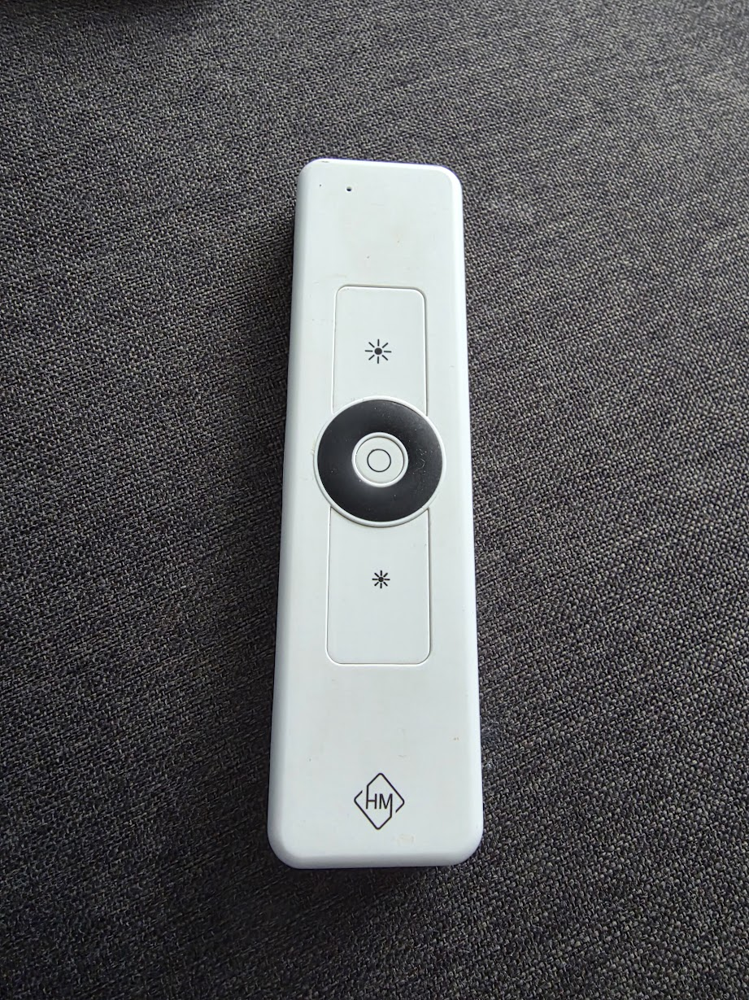
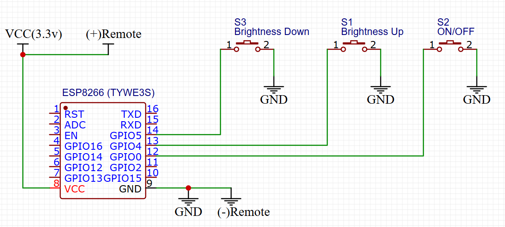
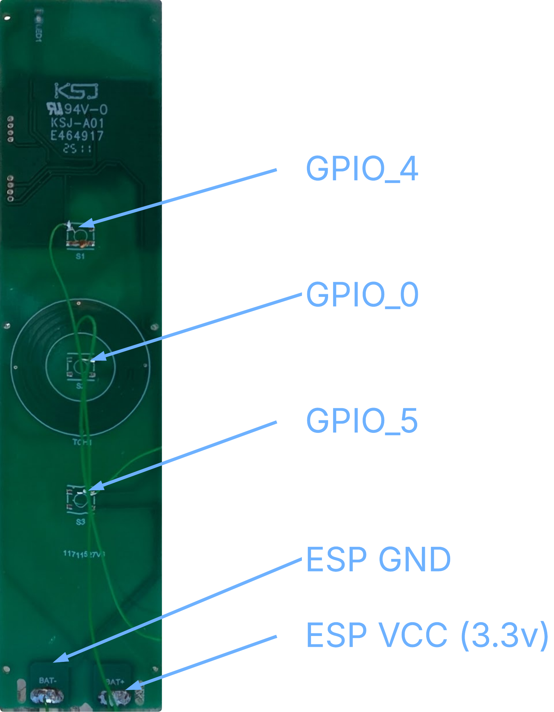

# Garden Lights — ESPHome remote bridge

This repository contains an ESPHome configuration (`garden_light_remote.yaml`) that repurposes a TYWE3S (ESP8266/ESP8285) module to drive a [Hamulight L2446 remote](https://www.hamulight.com/remote-control-apex-for-ab-sets-1-channel-outdoorcore?srsltid=AfmBOoq8OLyqLG-D_hzAC7Js3LfmO9zx_DdTwaDgfvLzyl2YUZRVmM7K) directly by shorting the remote's button pads with open-drain GPIOs. It exposes three virtual buttons to Home Assistant: Toggle, Brighter, and Dimmer.



## What this does
- Drives the remote's physical button pads (TOGGLE, BRIGHTER, DIMMER) from ESP GPIOs.
- Uses open-drain outputs with inversion so the ESP pulls a pad LOW to simulate a button press, and releases the pad to let the remote's pull-up return it HIGH.
- Exposes template `button` entities in Home Assistant via the native API, so you can trigger the remote from automations or the UI. Simple place your remote with the ESP connected near your Lights and control it from Home Assistant. Also removes the need for batteries since the ESP power rails can be used to power the remote control

## Wiring (as implemented in the YAML)
1. Remove the remote's batteries and open the casing to reveal the PCB.
2. Power the remote VCC from the ESP's 3.3V rail.
3. Connect ESP GND to the remote GND.
4. Connect the ESP GPIOs to the remote button pads:
   - `GPIO4`  -> TOGGLE pad
   - `GPIO0`  -> BRIGHTER pad
   - `GPIO5`  -> DIMMER pad

Important: Do not exceed 3.3V on the remote's pads. Use the TYWE3S 3.3V supply and common ground.

### Circuit diagram



### Remote PCB



## How it works (summary)
- Each GPIO is configured as `open_drain` and `inverted: true` in `garden_light_remote.yaml`.
- `turn_on` drives the pin LOW (press), `turn_off` releases the pin (float/high) so the remote sees a released button.
- The `press_duration` substitution controls how long the pin is held low (default 120ms).

## Usage
1. Review and update secrets (Wi‑Fi, API/OTA credentials). The YAML currently references `!secret` for Wi‑Fi, but contains an API encryption key and OTA password in-file — replace or remove these before sharing or publishing.
2. From this project directory you can flash or run the device with the `esphome` CLI:

```bash
esphome run garden_light_remote.yaml
```

3. After the device starts, the three buttons appear in Home Assistant via the native API. Use them like any other `button` entity.

## Configuration notes
- `substitutions` contains `device_name`, `friendly_name`, and `press_duration` for easy customization.
- Board: `esp01_1m` (TYWE3S / 1 MB flash). Keep that board setting for compatible modules.
- The YAML includes an `api.encryption.key` and an `ota` password; for security, move these into Home Assistant secrets or generate new values before deploying to production.

## Safety & privacy
- Avoid powering the remote from an external supply above 3.3V.
- Do not commit secrets (Wi‑Fi, OTA passwords, API keys) to public repositories.

## Similar Projects
Check out the amazing work in [darth-hp's project](https://github.com/darth-hp/Hamulight-L2446-Emulator-ESPhome) to reverse engineer the RF signals


## License
This README is provided as-is. Check other files for licensing of configuration content if applicable.
